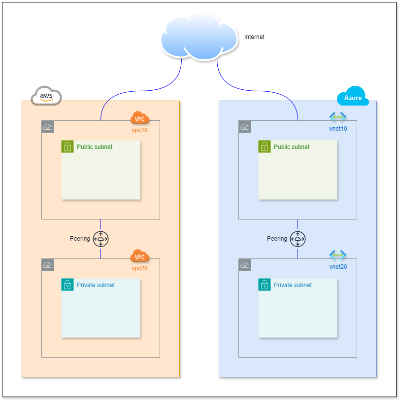

# app-staticsite-lb-peering-multicloud

Este projeto utiliza Terraform para gerenciar recursos na AWS e na Azure. Abaixo estão descritos os recursos gerenciados em cada provedor de nuvem.

## Visão geral da infraestrutura

## Recursos Gerenciados

| Recurso                | AWS                                      | Azure                                      |
|------------------------|------------------------------------------|--------------------------------------------|
| Rede Virtual           | VPC                                      | Virtual Network (VNet)                     |
| Sub-redes              | Subnets públicas e privadas              | Subnets públicas e privadas                |
| Gateway de Internet    | Internet Gateway                         | -                                          |
| Tabelas de Roteamento  | Route Tables                             | -                                          |
| Peering de Rede        | VPC Peering                              | Virtual Network Peering                    |
| Grupo de Recursos      | -                                        | Resource Group                             |
| Grupo de Segurança de Rede | Security Groups                        | Network Security Group (NSG)               |

## Recursos Gerenciados na AWS

### VPC (Virtual Private Cloud)
- Criação de uma VPC para isolar recursos da rede.
- Configuração de sub-redes públicas e privadas.
- Configuração de tabelas de roteamento e gateways de internet.

### Subnets
- Criação de sub-rede pública com mapeamento de IP público no lançamento.
- Criação de sub-rede privada.

### Internet Gateway
- Criação de um gateway de internet para a VPC pública.

### Route Tables
- Configuração de tabelas de roteamento para sub-redes públicas e privadas.
- Associação de tabelas de roteamento com sub-redes.

### VPC Peering
- Configuração de peering entre VPCs para permitir comunicação entre elas.

## Recursos Gerenciados na Azure

### Resource Group
- Criação de um grupo de recursos para organizar todos os recursos Azure.

### Virtual Network (VNet)
- Criação de VNets para isolar recursos da rede.
- Configuração de sub-redes públicas e privadas.

### Subnets
- Criação de sub-rede pública e privada dentro das VNets.

### Network Security Group (NSG)
- Criação de grupos de segurança de rede para controlar o tráfego de entrada e saída.
- Associação de NSGs com sub-redes.

### Virtual Network Peering
- Configuração de peering entre VNets para permitir comunicação entre elas.

### Network Security Group Association
- Associação de sub-redes com grupos de segurança de rede.

### Outros Recursos
- Configuração de regras de segurança específicas para permitir ou negar tráfego.

## Uso do Arquivo `multiprovider.yaml`

O arquivo `multiprovider.yaml` define um workflow do GitHub Actions para automatizar o deploy dos recursos na AWS e na Azure. Abaixo estão os passos executados pelo workflow:

1. **Setup Terraform**: Configura o Terraform com a versão especificada.
2. **Checkout do Código**: Faz o checkout do repositório.
3. **Inicialização do Terraform**: Inicializa o Terraform.
4. **Plano do Terraform**: Gera um plano de execução do Terraform.
5. **Aplicação do Plano**: Aplica o plano gerado para provisionar os recursos.
6. **Mostrar o Estado**: Exibe o estado dos recursos provisionados.

Para executar o workflow, certifique-se de que as variáveis de ambiente necessárias estão configuradas corretamente no GitHub Actions.
